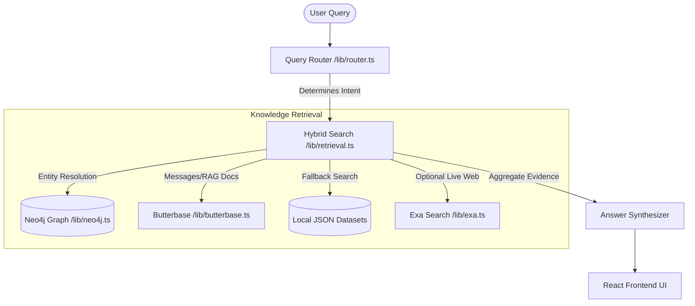

# Voltaire — Universal Memory Search

AI-powered universal search platform that indexes, retrieves, and synthesizes interactions across multiple connected platforms (e.g., Instagram, Google Meet, and the Web).

> [!NOTE]
> Voltaire resolves semantic relationships (e.g., identifying who your "boss" is or mapping online usernames to real names) using **Neo4j** and performs hybrid context retrieval using **Butterbase** (keyword & RAG search) and **Exa** web search.

---

## 🚀 Key Features

* **Intent Routing:** Heuristically routes search queries to target either personal conversations, work meetings, flights, or general cross-source searches. See [lib/router.ts](file:///Users/medikonda/voltaire/lib/router.ts).
* **Graph-Relational Lookup:** Uses a Neo4j database to build a semantic network of people, meetings, sources, and action items. This enables queries like *"What did my boss tell me?"* to resolve who your boss is and retrieve their specific meeting statements. See [lib/graphSearch.ts](file:///Users/medikonda/voltaire/lib/graphSearch.ts).
* **Hybrid Context Retrieval:** Combines structured database lookups with full-text messages, RAG documents, and real-time web search inputs. See [lib/retrieval.ts](file:///Users/medikonda/voltaire/lib/retrieval.ts).
* **Beautiful Dashboard Interface:** Presents unified search results, including direct citations, evidence cards, flight lists, and a live step-by-step loading trace of the query pipeline. See [app/page.tsx](file:///Users/medikonda/voltaire/app/page.tsx).

---

## 🛠️ Architecture & Core Components



* **Frontend App:** built on Next.js 16 (App Router) and Tailwind CSS. The interface is defined in [app/page.tsx](file:///Users/medikonda/voltaire/app/page.tsx) and styles in [app/globals.css](file:///Users/medikonda/voltaire/app/globals.css).
* **API Endpoints:**
  * `POST /api/search` — Runs hybrid searches. Matches query intent, searches sources, and constructs answers. See [app/api/search/route.ts](file:///Users/medikonda/voltaire/app/api/search/route.ts).
  * `POST /api/seed` — Seeds Neo4j relationships. See [app/api/seed/route.ts](file:///Users/medikonda/voltaire/app/api/seed/route.ts).
  * Ingestion endpoints: [app/api/ingest/instagram/route.ts](file:///Users/medikonda/voltaire/app/api/ingest/instagram/route.ts) and [app/api/ingest/meetings/route.ts](file:///Users/medikonda/voltaire/app/api/ingest/meetings/route.ts).
* **Acceptance Tests:** Verifies intent routing, query answers, and Neo4j graph trace functionality. See [scripts/acceptance.ts](file:///Users/medikonda/voltaire/scripts/acceptance.ts).

---

## ⚙️ Configuration & Environment Setup

Copy `.env.example` to `.env.local` and fill in the configuration values:

```bash
cp .env.example .env.local
```

### Required Variables:
* **Butterbase:**
  * `NEXT_PUBLIC_BUTTERBASE_APP_ID`
  * `NEXT_PUBLIC_BUTTERBASE_API_URL`
  * `NEXT_PUBLIC_BUTTERBASE_ANON_KEY`
  * `BUTTERBASE_SECRET_KEY`
* **Exa API:**
  * `EXA_API_KEY` (Used for web search fallback details)
* **OpenAI:**
  * `OPENAI_API_KEY` (Optional; if provided, dynamically generates LLM answers instead of using hardcoded template fallbacks)
  * `OPENAI_MODEL` (Defaults to `gpt-4o-mini` if not set)
* **Neo4j DB:**
  * `NEO4J_URI`
  * `NEO4J_USERNAME`
  * `NEO4J_PASSWORD`

---

## 🏃 Getting Started

### 1. Install dependencies
```bash
npm install
```

### 2. Run the Development Server
```bash
npm run dev
```
Open [http://localhost:3000](http://localhost:3000) to view the application.

### 3. Run Acceptance Checks
```bash
npm run test:acceptance
```
